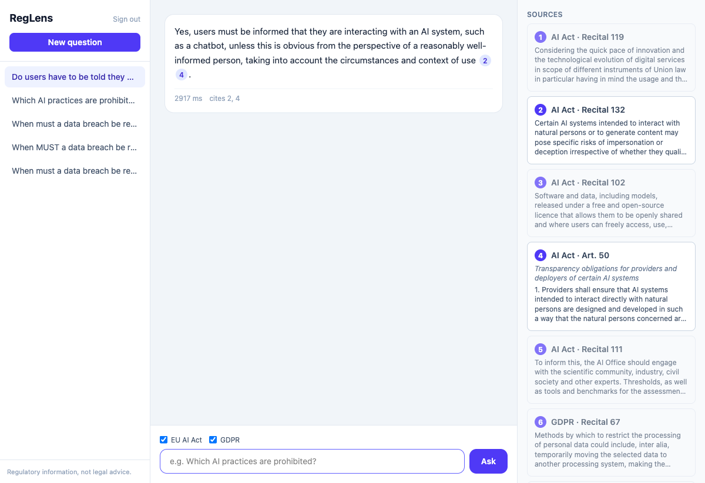
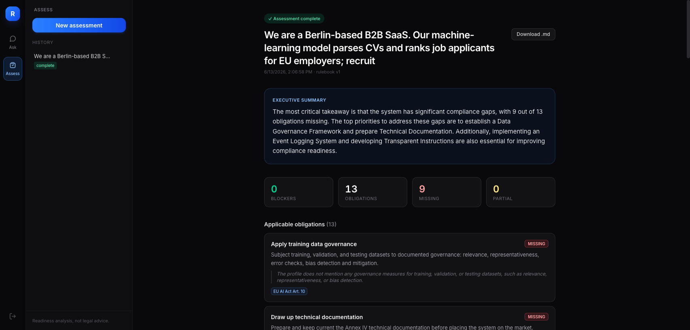

# RegLens

**Grounded compliance Q&A over the EU AI Act and GDPR** — a production-grade,
multi-tenant RAG platform. Every answer is cited to the article/recital level;
questions the corpus cannot support are refused, not hallucinated.



> ⚠️ RegLens provides information, not legal advice.

## Why this exists

Generic LLM chat is unusable for compliance work: answers must be grounded in
the actual legal text, verifiable, and auditable. RegLens demonstrates how to
build that properly — hybrid retrieval, citation validation, CI-gated
evaluation, multi-tenant auth, rate limiting, caching, and self-hosted
observability — in one inspectable codebase.

## Architecture

React SPA → FastAPI → hybrid retrieval (pgvector + Postgres FTS, reciprocal
rank fusion) → grounded generation with citation post-validation → SSE
streaming. Postgres (Alembic migrations) for all state, Redis for caching and
per-tenant rate limits, Supabase for auth, Prometheus + Grafana for
observability. See [docs/DESIGN.md](docs/DESIGN.md) and
[docs/PLAN.md](docs/PLAN.md).

## Quick start

```bash
docker compose up -d            # postgres+pgvector, redis, api, prometheus, grafana
cd backend
cp .env.example .env            # add your OpenRouter (or OpenAI-compatible) API key
uv sync
uv run alembic upgrade head     # apply migrations
uv run python -m app.cli ingest ai-act gdpr   # fetch, parse, chunk, embed, store
uv run uvicorn app.main:app --reload

cd ../frontend && npm install && npm run dev   # SPA on http://localhost:5173
```

Or run the whole stack containerized: `docker compose up -d --build` serves
the SPA at http://localhost:3000 through nginx (SSE-safe proxy to the API).

The ingestion CLI downloads the official EUR-Lex HTML (cached under
`backend/data/raw/`), parses it into articles, recitals and annexes, produces
hierarchy-aware chunks with contextual headers, embeds them via the
configured provider, and stores everything transactionally. Use
`--skip-embed` to inspect parsing without an API key.

### Authentication

The API verifies Supabase-compatible JWTs — either HS256 with
`REGLENS_SUPABASE_JWT_SECRET` (legacy projects, local dev) or asymmetric keys
via `REGLENS_SUPABASE_JWKS_URL` (new Supabase projects). A user's first
authenticated request just-in-time provisions a personal tenant; an
`app_metadata.tenant_id` claim attaches users to an existing workspace
instead. For local development, mint a token without any Supabase project:

```bash
uv run python scripts/dev_token.py --email you@example.com
curl -N localhost:8000/api/v1/chat \
  -H "Authorization: Bearer <token>" -H 'Content-Type: application/json' \
  -d '{"question":"Which AI practices are prohibited?"}'
```

### Caching & rate limiting

- Successful grounded answers are cached in Redis, keyed by normalized
  question + generation model + exact corpus versions (re-ingesting or
  switching models invalidates naturally). Repeat questions return in ~1ms.
- Per-tenant sliding-window rate limiting (default 30 req/min) runs as a
  single atomic Redis Lua script; 429 responses carry `Retry-After`. Limits
  survive API restarts because the window lives in Redis.

### Observability

- Structured JSON logs with request IDs; Prometheus metrics at `/metrics/`
  (HTTP RED metrics plus RAG-specific series: chat outcomes, retrieval top
  score, token throughput, LLM spend, cache hit ratio).
- Two auto-provisioned Grafana dashboards (`admin`/`admin` at
  http://localhost:3001): **Service Health** and **RAG Quality & Cost**.
- Optional [Langfuse](https://langfuse.com) LLM tracing — set
  `REGLENS_LANGFUSE_PUBLIC_KEY`/`_SECRET_KEY` and every chat produces a trace
  with retrieval and generation spans, token usage, cost, and tenant tags.
  Off by default; zero overhead when unset.

### Hardening

- RFC 7807 `application/problem+json` errors everywhere (with request IDs);
  unhandled exceptions never leak internals.
- Security headers, request body size limits, strict input validation.
- Prompt-injection defenses: retrieved text is wrapped in delimited source
  blocks the model is instructed to treat as data; citations are
  post-validated server-side.

- API docs: http://localhost:8000/docs
- Metrics: http://localhost:8000/metrics/ · Grafana: http://localhost:3001

## Cost engineering

Measured levers, in order of impact (full rationale in commit history):

| Strategy | Implementation | Measured effect |
|---|---|---|
| Response caching | Redis answer cache keyed by normalized question + model + corpus versions | Repeat answers in ~1 ms, $0 |
| Prompt compression | Retrieved chunks grouped per article, long embedded headers replaced by short labels (`GDPR — Art. 6`) | −15% prompt tokens on identical questions, evals confirm no quality loss |
| Output capping | `max_tokens=1024` on every generation | Bounds worst-case cost per request |
| Embedding cache | Redis-cached query embeddings (7-day TTL) | Repeat questions skip the embedding call even on answer-cache misses |
| Model selection | `evals.cli generation --generation-model <candidate>` runs the full gate suite against a cheaper model before switching the default | Eval-gated downgrades instead of vibes |
| Refusal-before-generation | Weak retrieval refuses pre-LLM | Off-corpus questions cost $0 in generation |
| Batching | Ingestion embeds 64 chunks/call; eval questions embed in one call | Chat requests are deliberately *not* batched — latency beats batching for interactive use |

Per-request cost (gpt-4o-mini, OpenRouter-reported): ~$0.0004 per grounded answer.

Security posture, threat model, and the production deployment checklist live
in [SECURITY.md](SECURITY.md).

## Evaluation

RegLens ships a versioned golden dataset (54 labeled questions over both
regulations — including annex coverage, out-of-corpus and red-team
adversarial cases: instruction override, system-prompt extraction,
outside-knowledge bait)
and a threshold-gated eval harness that exercises the real production
pipeline:

```bash
cd backend
uv run python -m evals.cli retrieval     # deterministic: recall@K, MRR
uv run python -m evals.cli generation    # full pipeline + LLM-as-judge
```

Measured baseline (dataset v3, `gpt-4o-mini` generation, `gpt-4o` judge):

| Metric | Result | Gate |
|---|---|---|
| Retrieval recall@8 | **1.00** | ≥ 0.85 |
| Retrieval recall@5 | 0.96 | — |
| Retrieval MRR | 0.69 | ≥ 0.60 |
| Faithfulness (judge) | **1.00** | ≥ 0.80 |
| Citation precision (judge) | 0.97 | ≥ 0.80 |
| Answer relevance (judge) | 1.00 | — |
| Refusal accuracy (8 adversarial/red-team cases) | **1.00** | ≥ 0.80 |
| False refusal rate | 0.00 | ≤ 0.10 |

The CLI exits non-zero on any gate failure, persists runs to the `eval_runs`
table, and writes a full report to `evals/reports/latest.json`. A
`workflow_dispatch` GitHub Action provisions Postgres, ingests the corpus,
and runs the suite in CI.

Known tuning opportunity (documented, intentionally not over-fit): recitals
often outrank operative articles in MRR because their narrative style is
semantically closer to natural questions; kind-weighted RRF would lift MRR
further. Recall@8 = 1.0 means generation always receives the right article.

## Development

```bash
cd backend
uv run pytest          # tests
uv run ruff check .    # lint
uv run mypy app        # types
```

## Status

- [x] M0 — Foundation: API skeleton, Alembic, Docker, observability middleware, CI
- [x] M1 — Corpus ingestion (EUR-Lex articles/recitals/annexes → hierarchy-aware chunks → embeddings, OpenRouter-compatible)
- [x] M2 — Hybrid retrieval (pgvector + FTS + RRF) + grounded generation with citation validation + SSE
- [x] M3 — Supabase-compatible JWT auth, JIT tenancy, Redis sliding-window rate limiting, answer caching, conversation history
- [x] M4 — Evaluation harness: golden dataset, recall@K/MRR, LLM-judge faithfulness, threshold gates, CI workflow
- [x] M5 — React SPA: streaming chat, clickable citation chips, source panel, history, corpus filter; nginx Docker image
- [x] M6 — RAG metrics + provisioned Grafana dashboards, optional Langfuse tracing, problem+json errors, security headers, body limits
- [x] Security & cost hardening — see SECURITY.md and Cost engineering
- [ ] M7 — Docs & demo
- [ ] v2 — Compliance Assessment Agent: system description → grounded readiness report ([design](docs/ASSESSMENT_AGENT.md)) — A0–A3 landed: annex ingestion, rulebook v1 (31 rules), staged engine (profile → classification → obligation mapping → gaps → remediation → report) with markdown export and clarification round, plus the React UI (intake, live stage timeline, report view). A4 (evals + hardening) next.


