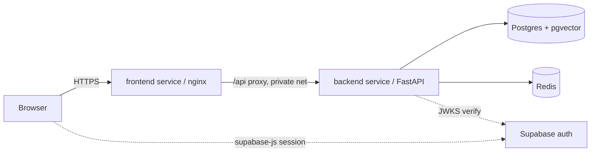

# Deploying RegLens to Railway

RegLens runs on Railway as **two app services** plus **two managed datastores**:

| Service | Source | Build | Serves |
| --- | --- | --- | --- |
| `backend` | `backend/` | `backend/Dockerfile` | FastAPI API (uvicorn) |
| `frontend` | `frontend/` | `frontend/Dockerfile` | React SPA (nginx, proxies `/api`) |
| `Postgres` | Railway plugin | — | App data + pgvector |
| `Redis` | Railway plugin | — | Answer cache + rate limits |

Auth is provided by a Supabase project — set that up first using
[SUPABASE.md](SUPABASE.md).



## 1. Create the project and datastores

1. Install the CLI (`npm i -g @railway/cli`) and `railway login`, or use the
   dashboard.
2. Create a new project.
3. Add **Postgres**: New → Database → Add PostgreSQL. Railway's Postgres
   supports the `vector` extension, which the baseline migration enables on
   first deploy.
4. Add **Redis**: New → Database → Add Redis.

## 2. Backend service

Create a service from this repo with the **root directory set to `backend`**.
Railway reads `backend/railway.json`, builds the Dockerfile, runs migrations on
start, and health-checks `/healthz`.

The start command (in `railway.json`) is:

```
alembic upgrade head && uvicorn app.main:app --host 0.0.0.0 --port ${PORT}
```

`${PORT}` is injected by Railway; do not hardcode it.

### Backend environment variables

Reference the datastore variables so they stay in sync. Railway exposes
`DATABASE_URL` and `REDIS_URL` from the plugins; RegLens needs the async
driver, so map them with the `+asyncpg` scheme.

| Variable | Value | Notes |
| --- | --- | --- |
| `REGLENS_DATABASE_URL` | `postgresql+asyncpg://${{Postgres.PGUSER}}:${{Postgres.PGPASSWORD}}@${{Postgres.RAILWAY_PRIVATE_DOMAIN}}:5432/${{Postgres.PGDATABASE}}` | async driver scheme is required |
| `REGLENS_REDIS_URL` | `redis://default:${{Redis.REDIS_PASSWORD}}@${{Redis.RAILWAY_PRIVATE_DOMAIN}}:6379/0` | uses the private network |
| `REGLENS_LLM_API_KEY` | your OpenRouter (or OpenAI-compatible) key | required for embeddings + generation |
| `REGLENS_LLM_BASE_URL` | `https://openrouter.ai/api/v1` | change for a different provider |
| `REGLENS_SUPABASE_JWKS_URL` | `https://<ref>.supabase.co/auth/v1/.well-known/jwks.json` | from Supabase |
| `REGLENS_SUPABASE_ISSUER` | `https://<ref>.supabase.co/auth/v1` | optional but recommended |
| `REGLENS_CORS_ORIGINS` | `["https://<your-frontend-domain>"]` | the frontend's public URL, JSON array |
| `REGLENS_LOG_QUESTION_TEXT` | `false` | keep false in production |

All other settings have safe defaults (`backend/app/core/config.py`); override
only what you need. Never set a Supabase `service_role` key — RegLens does not
use one.

### Seed the corpus

Migrations create the schema but not the regulation content. After the first
successful deploy, run the ingestion once against the deployed database:

```bash
railway run --service backend -- python -m app.cli ingest ai-act gdpr
```

This needs `REGLENS_LLM_API_KEY` (it embeds chunks). It is idempotent per
corpus version.

## 3. Frontend service

Create a second service from the same repo with the **root directory set to
`frontend`**. It reads `frontend/railway.json` and builds the Dockerfile.

The SPA inlines its Supabase config at **build time**, so these must be set as
service variables **before the build** (Railway exposes service variables as
Docker build args for Dockerfile builds):

| Variable | Value | Notes |
| --- | --- | --- |
| `VITE_SUPABASE_URL` | `https://<ref>.supabase.co` | build-time, browser-safe |
| `VITE_SUPABASE_ANON_KEY` | the anon/publishable key | build-time, browser-safe |
| `BACKEND_URL` | `http://${{backend.RAILWAY_PRIVATE_DOMAIN}}:8000` | runtime; nginx upstream for `/api` |
| `PORT` | (leave unset) | Railway injects it; the entrypoint reads it |

How the frontend reaches the backend: the nginx config is rendered at container
start from `nginx.conf.template`, substituting `BACKEND_URL` into the `/api`
`proxy_pass`. The browser only ever talks to the frontend's public domain;
nginx forwards `/api` calls to the backend over Railway's private network. This
keeps SSE streaming working (the proxy disables buffering) and means the backend
needs no public domain unless you want one.

> Deploy order: deploy the **backend first** so its private domain resolves.
> nginx resolves the upstream host at startup, so if `BACKEND_URL` points at a
> service that does not exist yet the frontend will fail to boot. Redeploy the
> frontend after the backend is up.

## 4. Networking summary

- Frontend: public domain (Railway-generated or custom). Generate it under the
  service's Settings → Networking → Public Networking.
- Backend: reached privately by the frontend via
  `backend.RAILWAY_PRIVATE_DOMAIN`. Expose a public domain only if you want to
  call the API directly; if you do, add it to `REGLENS_CORS_ORIGINS`.
- Postgres / Redis: private only.

## 5. Verify the deploy

1. **Backend health:** the service's Deployments tab should show the health
   check on `/healthz` passing. If you gave it a public domain:

   ```bash
   curl -s https://<api-domain>/healthz      # {"status":"ok"}
   curl -s https://<api-domain>/readyz       # {"status":"ok","database":"up"}
   ```

   `/readyz` returning `database: up` confirms migrations ran and Postgres is
   reachable.

2. **Frontend:** open the public domain. The SPA loads and shows the login
   page.

3. **End-to-end:** sign in, then ask "Which AI practices are prohibited?". A
   streamed, cited answer confirms the whole chain — SPA → nginx `/api` proxy →
   backend → Postgres/pgvector retrieval → generation, with the Supabase token
   verified along the way.

4. **Corpus present:** if answers come back refused with "no supporting text",
   the corpus was not seeded — run the ingestion step from section 2.

## Troubleshooting

- **Frontend boots then crashes / 502:** `BACKEND_URL` is wrong or the backend
  is not up yet. Confirm the backend deployed first and the variable matches its
  private domain and port (`8000`).
- **CORS errors in the browser console:** you are calling the backend's public
  domain directly; add that origin to `REGLENS_CORS_ORIGINS`. The default proxy
  path needs no CORS because it is same-origin.
- **`/readyz` shows `database: down`:** check `REGLENS_DATABASE_URL` uses the
  `postgresql+asyncpg://` scheme and the Postgres private domain.
- **All answers refused:** corpus not ingested (section 2, "Seed the corpus").
